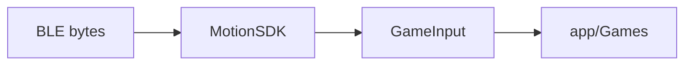

import SkillDownloads from '@site/src/components/SkillDownloads';

# Context for AI

If an assistant **misunderstands** this project, give it this page or the repo root file **`AGENTS.md`** (same facts, optimized for tools that auto-read the repository).

:::tip Szybko po polsku
**VeltoKit** = biblioteka Swift (`VeltoKit/`). **gametriki** = przykładowa aplikacja iOS (`app/`). Gry czytają tylko **`GameInput`**, nie surowe BLE. Szukaj w docs: **Search** (`⌘K` / `Ctrl+K`). Skill do Cursor/Claude: [For Cursor Claude](./for-cursor-claude#download-ai-skills).
:::

## Copy-paste prompt for any AI

```text
You are working on the VeltoKit repository (gametriki monorepo).
Read AGENTS.md at the repo root before answering or editing.
VeltoKit/ is the Swift SDK (MotionSDK → GameInput). app/ is the sample iOS app.
Games must use GameInput only. Triki UI is app-only navigation, not part of the SDK target.
When unsure, open VeltoKit/MotionSDK.swift, VeltoKit/GameInput.swift, and the matching file in app/Games/.
Human documentation source lives in website/docs/ (English).
```

## One-sentence summary

**VeltoKit** converts BLE cap IMU + button packets into **`GameInput`** each frame; **gametriki** is the reference app that demonstrates Pong, Dart, Bowling, and Quiz.

## Architecture (read in this order)

1. [Architecture](./sdk/architecture) — layers and frame pipeline  
2. [GameInput](./sdk/game-input) — field contract (what games use)  
3. [MotionSDK API](./sdk/motion-sdk) — `connect`, `pollInput`, `enqueueBLE`  
4. [Module map](./sdk/modules) — file-level map  



## Repo paths (not website URLs)

| Path | Role |
|------|------|
| `VeltoKit/MotionSDK.swift` | Public SDK entry |
| `VeltoKit/GameInput.swift` | Output struct — **ground truth for game code** |
| `app/Platform/TrikiInputAdapter.swift` | Sample adapter + calibration |
| `app/Engine/GameManager.swift` | Sets `MotionMode` per game |
| `app/Games/*.swift` | Integration examples |
| `website/docs/` | Documentation you are reading now |
| `AGENTS.md` (repo root) | Machine-oriented duplicate of this page |

## MotionMode cheat sheet

| Mode | Sample game | Key `GameInput` fields |
|------|---------------|-------------------------|
| `.paddle` | Pong, Quiz | `posX`, `primaryAction` |
| `.pointer` | Dart | `posX`, `posY`, `shotTriggered` |
| `.gesture` | Bowling | `shotTriggered`, `throwPower` |

Details: [examples](./examples/pong) · [configuration](./sdk/configuration).

## Task → which doc / file

| You want to… | Open |
|--------------|------|
| Add VeltoKit to a new app | [Quick Start](./quick-start), [installation](./installation) |
| Understand BLE bytes | [BLE integration](./sdk/ble-integration), `VeltoKit/BLE/` |
| Fix throw / gesture | [Gestures](./sdk/gestures), `VeltoKit/GestureDetector.swift` |
| Fix cap menus (focus, hold) | [Triki UI](./sdk/triki-ui), `app/UI/TrikiUI/` |
| Calibrate + simple Triki menu | [Triki UI — calibration & simple menu](./sdk/triki-ui#calibration-and-simple-menu), `QuizFlowView.swift` |
| Match Pong/Dart/Bowling/Quiz | `website/docs/examples/*` + `app/Games/` |

## Mistakes assistants often make

- Calling the sample app framework “gametriki SDK” — the SDK name is **VeltoKit** only.  
- Inventing `GameInput` fields that do not exist in `VeltoKit/GameInput.swift`.  
- Putting CoreBluetooth code inside `app/Games/` (belongs in SDK or Platform).  
- Ignoring `MotionMode` when changing `posX` / throw behavior.  

## Downloadable skills {#download-ai-skills}

<SkillDownloads showHeading={false} />

Also install from clone: `.cursor/skills/veltokit/SKILL.md` (Cursor) or paste into Claude Project instructions.

[For Cursor Claude hub](./for-cursor-claude) · [Skill for Cursor](./for-cursor) · [Skill for Claude](./for-claude)
