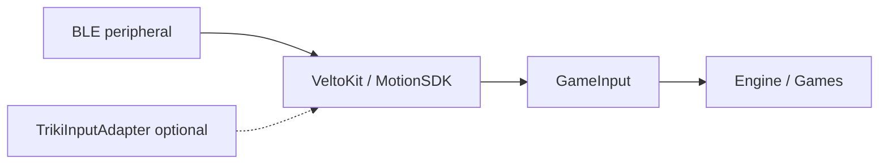

# Architecture

Gametriki splits **SDK** (pure motion) from **app** (BLE, games, UI). Games depend only on **`GameInput`** from VeltoKit.

## Layer diagram



## Frame pipeline (VeltoKit)

Each display tick (with `connect()` + `pollInput()`):

1. **BLE** — `BLEManager` delivers notify bytes → `enqueueBLE(_:)` (lazy pipeline on first `connect()`).
2. **Ingress** — `flushIngress()` parses gyro blocks (`BLEGyroParser`) or paddle raw int16.
3. **Button** — `ButtonDetector` watches `0x22` packets, rising edge on `bytes[1]`.
4. **MotionEngine.updateFrame** — runs mode-specific processor + gesture FSM.
5. **Publish** — `MotionSDK` copies `MotionOutput` + click/throw into `GameInput`.

```swift
let input = motion.pollInput(deltaTime: dt)   // preferred after connect()
// or: motion.enqueueBLE(bytes); motion.updateFrame(deltaTime: dt)
```

## Internal modules

| Component | Responsibility |
|-----------|----------------|
| `MotionProcessor` | Offset, smoothing, paddle integration, pointer rotation |
| `GestureDetector` | BACK → FORWARD throw, `throwPower` |
| `ButtonDetector` | BLE click edge |
| `MotionEngine` | Mode switch, calibration APIs, `output` / `debug` |
| `MotionSDK` | Facade: `connect()`, `pollInput()`, ingress, `input` |
| `BLEManager` | Scan, connect, notify (VeltoKit target) |
| `MotionParser` | Sensor struct + impulses (used by `pollInput`) |

## Platform (sample app, optional)

| Piece | Role |
|-------|------|
| `TrikiInputAdapter` | Forwards to `MotionSDK`; calibration UI |

`MotionInputProvider` is a type alias for `TrikiInputAdapter`.

### Triki UI navigation layer

For screen navigation, the sample app adds a thin UI layer on top of `MotionInputProvider`:

- `.trikiUIScreen(...)` wires per-screen lifecycle and ticking
- `TrikiUINavigator` maps `posX` to slots and triggers activation
- `TrikiFocusGate` + `TrikiHoldTracker` stabilize and confirm focus

See [Triki UI navigation](./triki-ui) for integration details and examples.

## Sample games

| Game | `MotionMode` | Primary fields |
|------|--------------|----------------|
| Pong | `.paddle` | `posX` |
| Dart | `.gesture` | `throwPower`, `shotTriggered` |
| Bowling | `.gesture` | throw → SceneKit force |
| Quiz | `.pointer` | `posX`, `primaryAction` |

## Threading

`MotionSDK`, `MotionEngine`, and `TrikiInputAdapter` are **`@MainActor`**. Call `update` / `pollInput` from the main thread (e.g. `CADisplayLink` or SwiftUI timer).

## Debug

- `motion.debug` — raw/smooth/rel, paddle steer, gyro block index
- `motion.output` — normalized `x`, `y`, `didShoot`, `paddleAtRest`
- DEV UI in the sample app exposes `MotionConfig` sliders

[MotionSDK API](./motion-sdk) · [Triki UI navigation](./triki-ui) · [BLE integration](./ble-integration)
